# Deploy Elasticsearch YARN Cluster

#### Open the Ambari UI
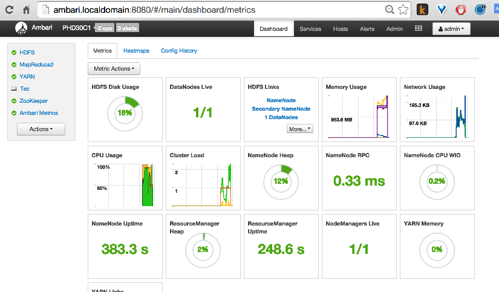

#### Select `Actions` -> `Add Services` menu
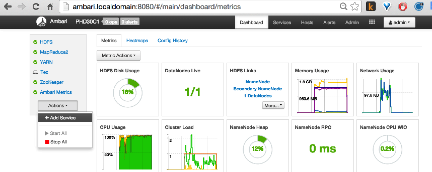

#### Select the `Elasticsearch YARN` service and press `Next`
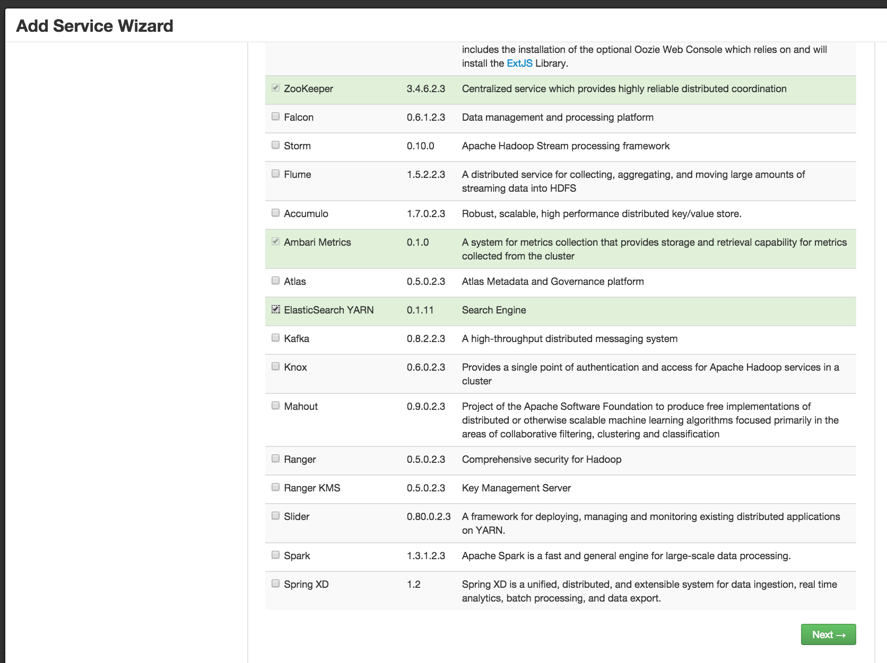

#### Select where to deploy the `Elasticsearch YARN Master` and press `Next`
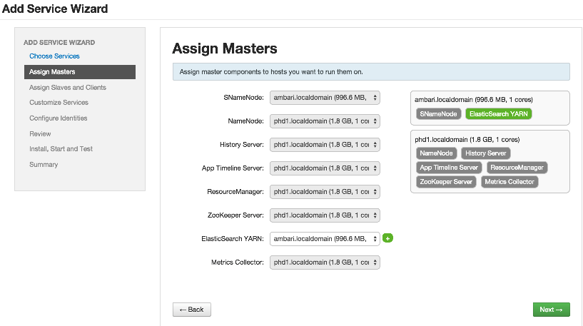

#### Edit the configuration and press `Next`
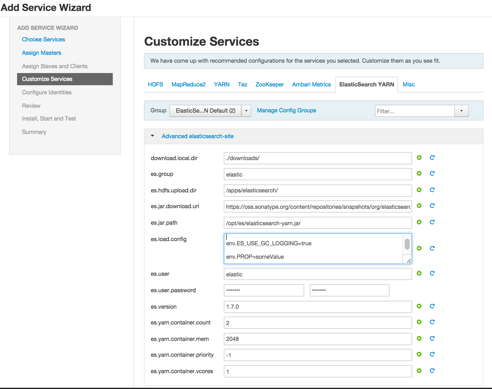

#### Wait the installation to complete and press `Next` 
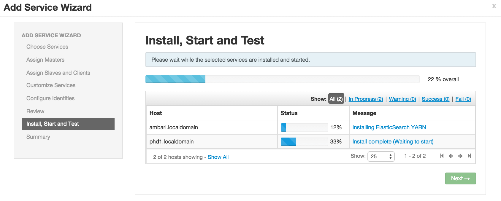`
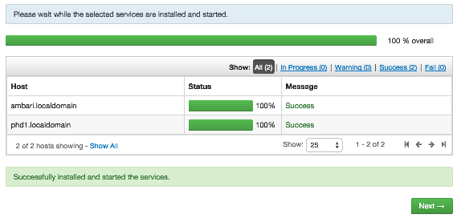

#### Check the Elasticsearch status.
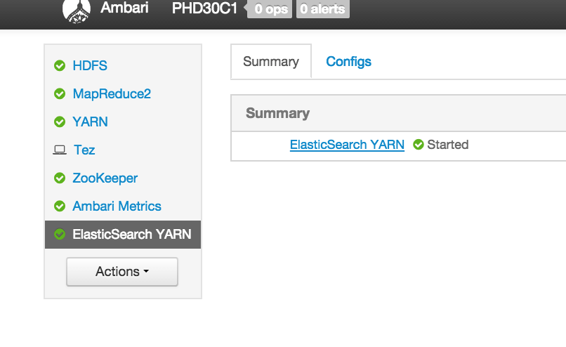

#### From the YARN UI check the ES AM and Containers statuses. 
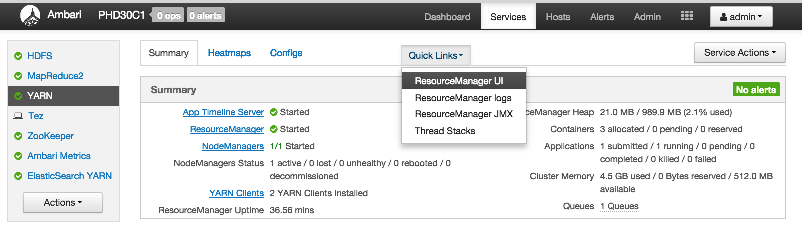
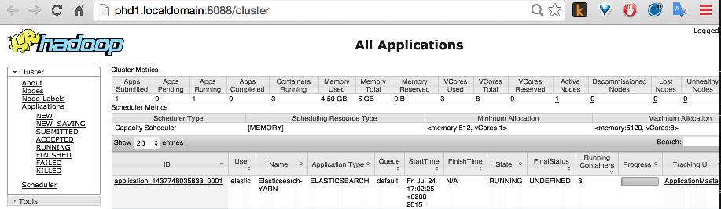
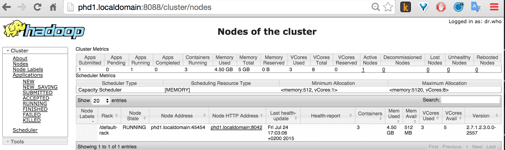

#### Finally use Elasticsearch API to check the healt of the cluster
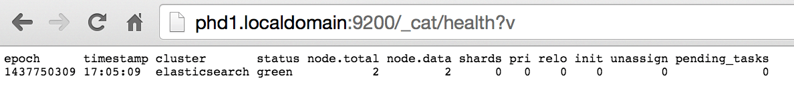
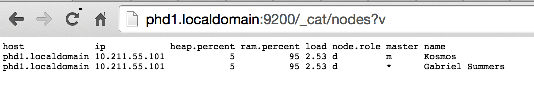

`Elasticsearch on YARN` usage guide: https://www.elastic.co/guide/en/elasticsearch/hadoop/current/ey-usage.html
